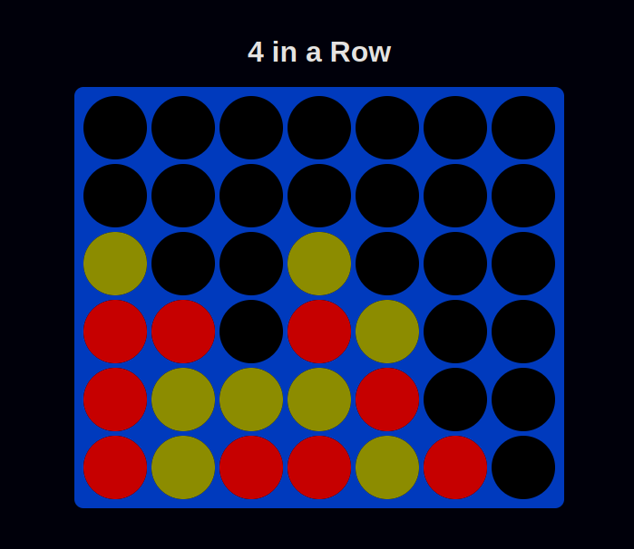

# 4 in a Row 🎮

A simple and fun **4 in a Row** game built with HTML, CSS, and JavaScript! 🎲🔥

## Features ✨
- Smooth falling animation for game pieces 🎭
- Two-player local gameplay 🤝
- Modern and responsive UI 🎨
- Win detection with a celebration screen 🎉
- Play again button to restart the game 🔄

## How to Play? 🕹️
1. Click on a column to drop your piece ⬇️
2. Players take turns (Red 🔴 vs Yellow 🟡)
3. The first to connect **4 in a row** (horizontally, vertically, or diagonally) wins! 🏆
4. Press **Play Again** to restart the game 🔁

## Installation 🛠️
1. Clone this repository:
   ```bash
   git clone https://github.com/mzums/connect_four
   ```
2. Open `index.html` in your browser 🌐

## Preview 📸



## Technologies Used 🚀
- HTML5
- CSS3 (Flexbox & Grid)
- JavaScript (DOM Manipulation & Event Handling)

## Future Improvements 🚀
- AI opponent 🤖
- Online multiplayer 🌍
- Sound effects & animations 🔊🎭

## License 📜
This project is open-source under the MIT License.

Enjoy the game! 🚀🔥

